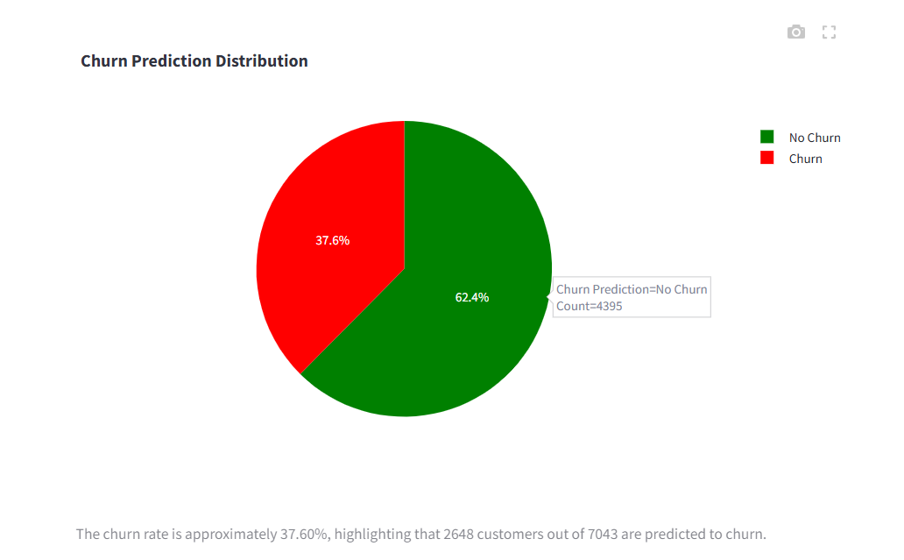
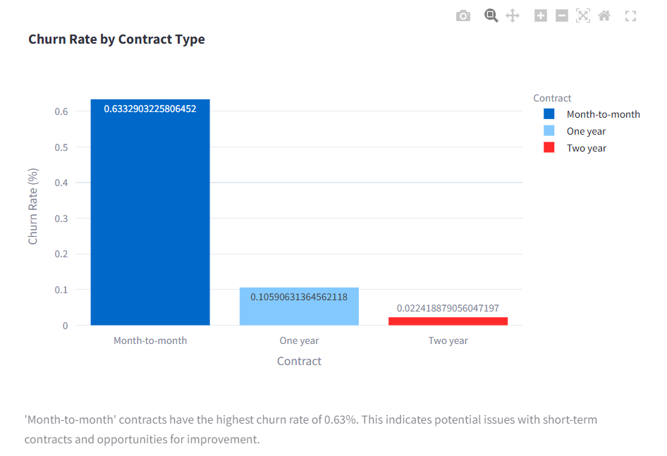
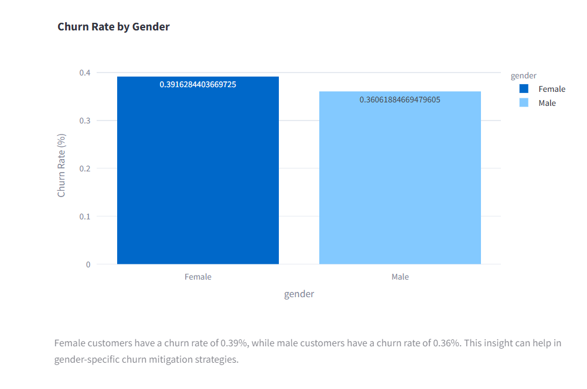
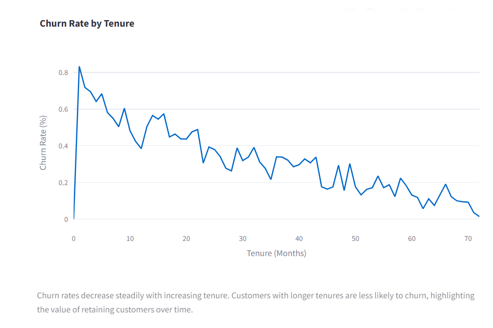
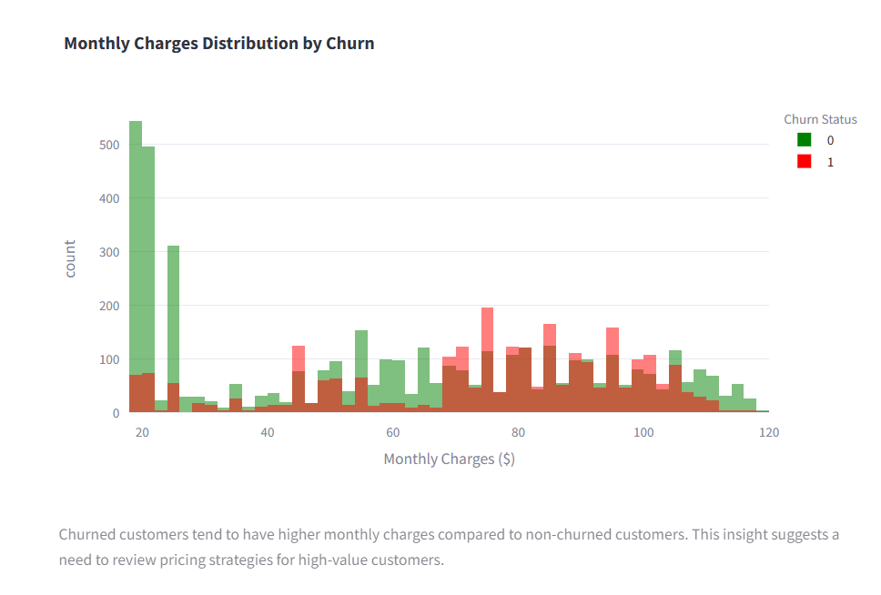
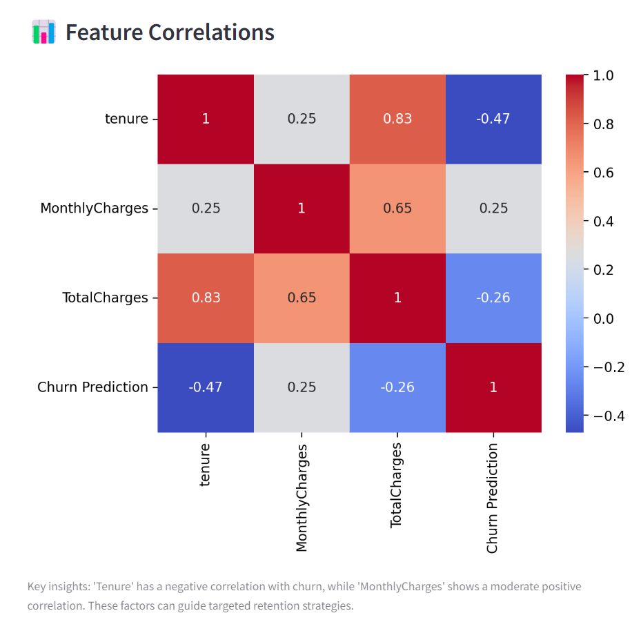

# Customer Churn Prediction Project

## 📋 Overview
This project focuses on predicting customer churn for a telecom company using the **Telco Customer Churn Dataset**. By leveraging machine learning models, it identifies key factors contributing to churn and provides actionable insights to help businesses improve customer retention.

The project includes:
- End-to-end workflows for data preprocessing, model training, and optimization.
- An interactive Streamlit app with features like **single prediction**, **batch processing**, and **dashboard visualizations**.

---

## 📑 Table of Contents
1. [Overview](#-overview)
2. [Live Demo](#-live-demo)
3. [Objectives](#-objectives)
4. [Project Workflow](#️-project-workflow)
   - [Data Preprocessing](#data-preprocessing)
   - [Model Training and Optimization](#model-training-and-optimization)
   - [App Deployment](#app-deployment)
5. [Key Insights and Results](#-key-insights-and-results)
   - [KPIs](#key-performance-indicators-kpis)
   - [Visualizations](#visualizations)
6. [How to Run Locally](#️-how-to-run-locally)
7. [Repository Structure](#-repository-structure)
8. [Future Work](#-future-work)
9. [License](#-license)

---

## 🌐 Live Demo
Explore the deployed app here: [Customer Churn Prediction App](https://datastatsmohith-customer-churn-prediction-appapp-zvje6e.streamlit.app/)

This interactive app provides:
- Single Customer Prediction: Predict churn for a single customer based on key features.
- Batch Prediction: Upload a CSV file containing multiple customer records to generate predictions for the entire batch.
- Dashboards: Visualize key insights, such as churn rates, feature correlations, and demographic trends.

---
## 🎯 Objectives
1. **Understand the factors influencing customer churn** using data analysis and visualization.
2. **Develop a machine learning model** to predict churn with high accuracy and interpretability.
3. **Provide business insights** through interactive dashboards and actionable KPIs.

---

## 🛠️ Project Workflow

### **Data Preprocessing**
- Handled missing values and inconsistent data (e.g., `TotalCharges` column).
- Encoded categorical features using `LabelEncoder`.
- Scaled numerical features like `tenure`, `MonthlyCharges`, and `TotalCharges` using `StandardScaler`.

### **Model Training and Optimization**
- Trained multiple models (Logistic Regression, Random Forest) and optimized them using `GridSearchCV`.
- Selected the best-performing model based on metrics like accuracy, F1-score, and AUC-ROC.
- Tuned decision thresholds for improved business interpretability using a custom optimal threshold.

### **App Deployment**
- Built an interactive **Streamlit app** with the following features:
  - **Single Customer Prediction**: Allows users to predict churn for a single customer.
  - **Batch Prediction**: Enables predictions for multiple customers through CSV upload.
  - **Dashboard**: Visualizes key insights like churn rates, feature correlations, and demographic trends.

---

## 📊 Key Insights and Results

### **Key Performance Indicators (KPIs):**


- **Total Customers**: 7043  
- **Churned Customers**: 2648  
- **Churn Rate**: 37.60%

---

### **Visualizations**
#### **1. Churn Prediction Distribution**

> The churn rate is approximately **37.60%**, with a significant proportion of customers predicted not to churn.

#### **2. Churn Rate by Contract Type**

> **Month-to-month contracts** have the highest churn rate, indicating potential issues with short-term customer retention.

#### **3. Churn Rate by Gender**

> Female customers have a slightly higher churn rate compared to male customers.

#### **4. Churn Rate by Tenure**

> Customers with longer tenures are less likely to churn, emphasizing the importance of customer retention strategies.

#### **5. Monthly Charges Distribution**

> Churned customers tend to have higher monthly charges, suggesting pricing strategy adjustments for high-value customers.

#### **6. Feature Correlations**

> Key insights:
- **Tenure** has a negative correlation with churn.
- **MonthlyCharges** and **TotalCharges** show a moderate positive correlation with churn.

---

## 🖥️ How to Run Locally

### Prerequisites
- Python 3.8 or higher
- Install dependencies listed in `requirements.txt`

### Steps
1. Clone the repository:
   ```bash
   git clone https://github.com/DataStatsMohith/customer-churn-prediction.git
   
2. Navigate to the directory:
   ```bash
   cd customer-churn-prediction
   ```

3. Install dependencies:
   ```bash
   pip install -r requirements.txt
   ```

4. Run the Streamlit app:
   ```bash
   streamlit run app/app.py
   ```

---

## 📂 Repository Structure

```plaintext
customer-churn-prediction/
│
├── app/                            # Streamlit app
│   └── app.py
│
├── assets/                         # Visualizations and animations
│   ├── *.png                       # Images for dashboards
│   └── animations/                 # JSON animations for Streamlit
│
├── data/                           # Dataset and preprocessed files
│   ├── WA_Fn-UseC_-Telco-Customer-Churn.csv
│   ├── feature_columns.pkl
│   ├── final_churn_model.pkl
│   ├── label_encoders.pkl
│   ├── optimal_threshold.pkl
│   └── scaler.pkl
│
├── notebooks/                      # Jupyter notebook(s)
│   └── FinalCustomer_Churn_Prediction.ipynb
│
├── README.md                       # Project documentation
├── requirements.txt                # Python dependencies
└── LICENSE                         # Project license (optional)
```

---

## 🚀 Future Work

- **Model Improvements**: Experiment with deep learning models for better performance.
- **Additional Features**: Incorporate customer satisfaction scores and support interactions.
- **Deployment**: Extend the app deployment to cloud platforms like AWS or Heroku.

---

## 📜 License

This project is licensed under the MIT License.

---


